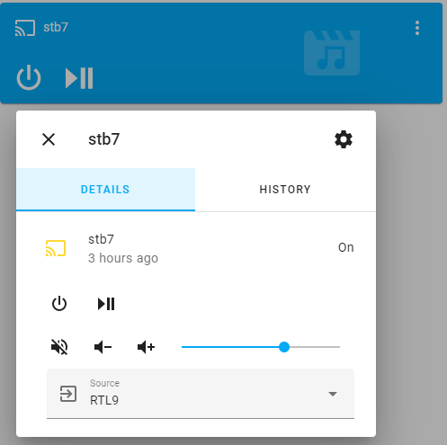
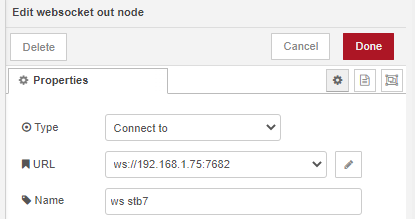
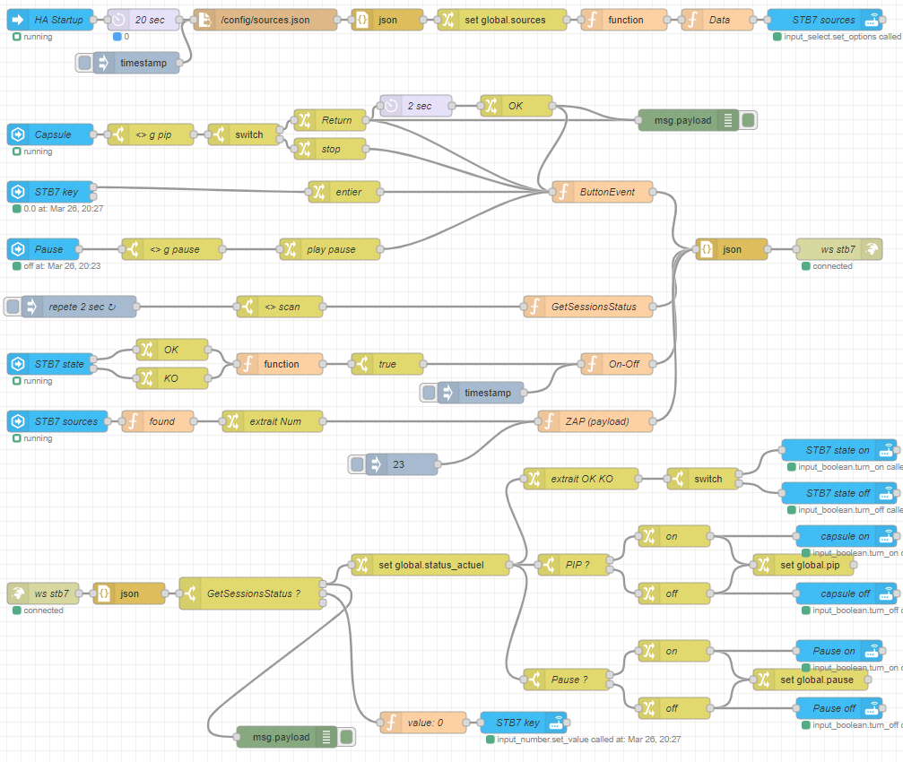
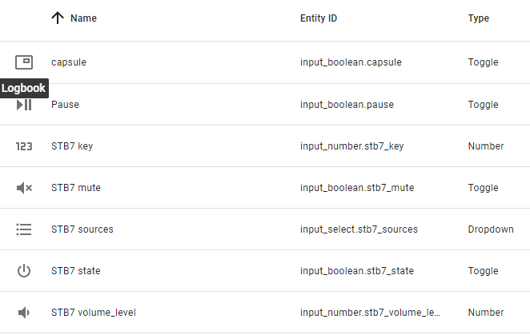

# sfr_decoder_ha

Having little knowledge of python, I created a mediaplayer to manage my SFR decoder by combining :

- universal media player
- HA helpers
- node red flow
- sources.json file which contains the titles of the channels

## Node Red

This flow is built around 2 websocket nodes.

You will need to enter the address of your decoder inside these nodes

### STB7.json

## Helpers

Here are the helpers used

STB7 key: You need to change maximum value to 309

STB7 sources: You can put any text to create it

On startup HA STB7 sources will be populated with the contents of sources.json

## Configuration.yaml

A simple universal mediaplayer

 [configuration.yaml](configuration.yaml) 

## Sources.json

This file must be put in your HA config directory

It is important that the names of the channels correspond exactly to what is returned by the decoder (json GetSessionsStatus)

 [sources.json](sources.json) 
